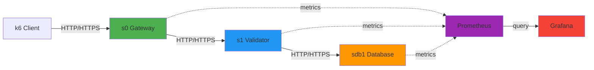
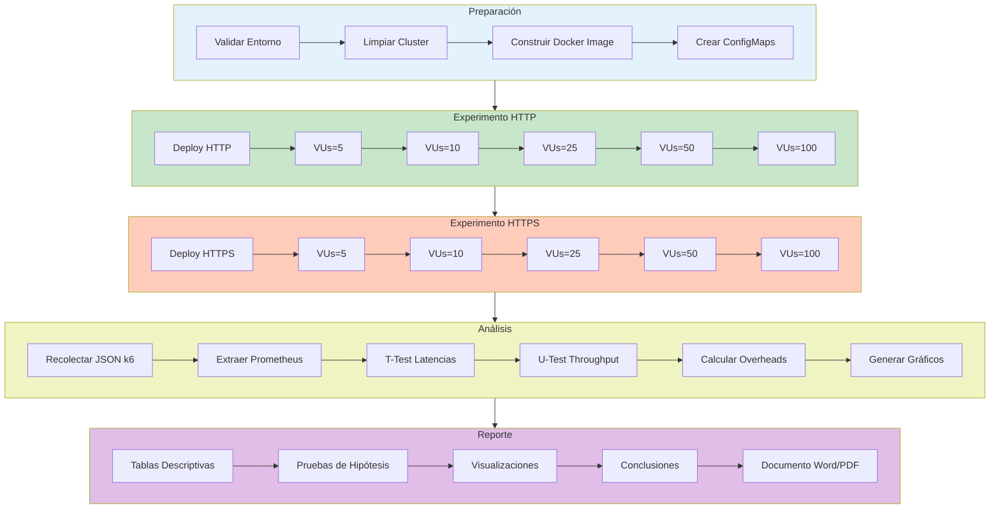

# Diseno Experimental Actualizado: Micros Realistas + Controles C1-C4

## 1. Proposito

Este documento actualiza el diseno experimental para reflejar el estado real del proyecto:

1. Capa base muBench.
2. Capa de microservicios realistas (auth-service, api-service, data-service, postgres).
3. Ejecucion hibrida automatizada desde el script principal.
4. Evaluacion de controles de seguridad C1-C4 con evidencia cuantitativa.

El objetivo no es solo comparar HTTP vs HTTPS, sino medir rendimiento-seguridad en una arquitectura mas cercana a produccion.

## 2. Preguntas de Investigacion

### 2.1 Pregunta principal

Cual es el impacto en latencia, tasa de error y capacidad de procesamiento al ejecutar cargas realistas y controles C1-C4 en un entorno Kubernetes local reproducible.

### 2.2 Preguntas secundarias

1. Que diferencia existe entre perfiles de carga quick, normal y stress sobre los micros realistas.
2. Como varia el comportamiento al activar cada control C1-C4 frente al baseline.
3. Si la degradacion observada se mantiene dentro de umbrales aceptables para operacion.
4. Si la evidencia generada es suficientemente trazable para reporte academico.

## 3. Alcance Experimental

### 3.1 Sistema bajo prueba

#### Capa base muBench

- Flujo baseline e inter-service de muBench.
- Dashboards y comparativas consolidadas.

#### Capa realista

- auth-service: login y emision de token.
- api-service: profile, users (GET/POST).
- data-service: logica y persistencia.
- postgres: almacenamiento de usuarios.

#### Observabilidad

- Prometheus para series de tiempo.
- Grafana para visualizacion y comparacion.
- Dashboard Kubernetes para estado operacional.

### 3.2 Controles evaluados

- C1: API Gateway / Ingress.
- C2: mTLS Service Mesh.
- C3: Network Policies.
- C4: Rate Limiting.

## 4. Hipotesis

### 4.1 Hipotesis principal

H1: La activacion de controles C1-C4 incrementa la latencia p95 respecto al baseline, pero con mejora de postura defensiva medible y con error rate controlado.

### 4.2 Hipotesis secundarias

- H2: El perfil stress amplifica diferencias entre baseline y controles.
- H3: C2 y C4 tienden a introducir mayor overhead relativo que C1 y C3 bajo la misma carga.
- H4: El flujo hybrid-quick es suficiente para validacion funcional y deteccion temprana de regresiones.

## 5. Variables del Estudio

### 5.1 Variables independientes

1. Perfil de carga:
   - hybrid-quick
   - hybrid
   - hybrid-stress
2. Control de seguridad activo:
   - baseline
   - c1-gateway
   - c2-mtls
   - c3-netpol
   - c4-ratelimit

### 5.2 Variables dependientes

1. http_req_duration p95.
2. http_req_failed rate.
3. users_created_total.
4. users_listed_total.
5. Total requests y checks exitosos.

### 5.3 Variables controladas

1. Misma infraestructura local (MicroK8s y hardware).
2. Misma version de scripts y manifiestos.
3. Mismo namespace realista y flujo de despliegue.
4. Misma ruta de ejecucion principal para evitar sesgo de operador.

## 6. Diseno Experimental

### 6.1 Tipo de diseno

Diseno cuasi-experimental con medidas repetidas sobre el mismo entorno:

1. Se fija el entorno.
2. Se aplica tratamiento (perfil/control).
3. Se registran metricas comparables.
4. Se repite por escenario.

### 6.2 Escenarios formales

#### Escenario S0: Validacion operacional minima

Comando:

./scripts/deploy_microk8s.sh --start --hybrid-quick

Finalidad:

- Confirmar que stack base + realistic + k6 + dashboards estan operativos.

#### Escenario S1: Carga hibrida normal

Comando:

./scripts/deploy_microk8s.sh --start --hybrid

Finalidad:

- Obtener metrica representativa de operacion normal.

#### Escenario S2: Carga hibrida stress

Comando:

./scripts/deploy_microk8s.sh --start --hybrid-stress

Finalidad:

- Observar degradacion bajo carga elevada y limites de estabilidad.

#### Escenario S3: Barrido de controles realistas

Comando:

./scripts/deploy_microk8s.sh --start --hybrid --hybrid-controls

Finalidad:

- Construir comparativo directo baseline vs C1 vs C2 vs C3 vs C4.

## 7. Flujo Operacional de Cada Corrida

1. Despliegue base muBench.
2. Pruebas k6 baseline e inter-service.
3. Despliegue de micros realistas.
4. Ejecucion k6 create/list sobre micros realistas.
5. Generacion de resumen automatico hybrid-k6-summary.
6. Publicacion/actualizacion de dashboards.
7. Generacion de consolidado C1-C4 y visualizaciones.

## 8. Evidencia y Artefactos Esperados

### 8.1 Evidencia de carga

- Testing/results/http-baseline-*.json
- Testing/results/http-interservice-*.json
- RealisticServices/results/k6-users-bulk-*.json

### 8.2 Evidencia resumida

- RealisticServices/results/hybrid-k6-summary-*.txt

Campos minimos del resumen:

1. users_created_total
2. users_listed_total
3. http_req_duration_p95_ms
4. http_req_failed_rate

### 8.3 Evidencia comparativa

- Testing/results/all-controls-comparison.csv
- Testing/results/all-controls-comparison.md
- Testing/results/all-controls-p95.png
- Testing/results/all-controls-avg-vus.png

## 9. Criterios de Exito Experimental

Una corrida se considera valida cuando:

1. El script principal termina sin error fatal.
2. Los pods realistas quedan en estado 1/1 Running.
3. Se generan archivos k6 esperados para base y realistic.
4. Se genera resumen hibrido automatico.
5. Se publica dashboard comparativo con panel de resumen hibrido.
6. La tasa de error permanece dentro de umbral definido para el escenario.

## 10. Analisis de Resultados

### 10.1 Descriptivo

Por cada escenario/control reportar:

1. p95 de latencia.
2. tasa de error.
3. volumen de creacion/listado de usuarios.

### 10.2 Comparativo

Comparar baseline contra cada control:

Overhead porcentual de latencia:

overhead_latencia = ((p95_control - p95_baseline) / p95_baseline) * 100

Degradacion de capacidad de creacion:

degradacion_create = ((create_baseline - create_control) / create_baseline) * 100

### 10.3 Decision

Un control se considera costo-efectivo cuando:

1. mejora postura de seguridad,
2. mantiene error rate en nivel aceptable,
3. su overhead es justificable para el riesgo mitigado.

## 11. Amenazas a la Validez y Mitigaciones

### 11.1 Validez interna

- Colision de port-forward local.
- Estado previo en base de datos.
- Saturacion de recursos del host.

Mitigaciones:

1. limpieza de port-forwards antes de cada corrida,
2. trazabilidad de timestamp y artefactos,
3. ejecucion en ventana de baja interferencia.

### 11.2 Validez externa

- Entorno local puede diferir de produccion multi-nodo.

Mitigaciones:

1. reportar configuracion exacta,
2. repetir perfiles en varios dias,
3. usar tendencias y no una unica corrida como conclusion.

## 12. Procedimiento de Reproducibilidad

Ruta recomendada:

1. Ejecutar protocolo de cero absoluto.
2. Correr S0 para sanidad.
3. Correr S1 y S2 para comportamiento de carga.
4. Correr S3 para comparativo de controles.
5. Consolidar evidencia en CSV/MD/PNG y dashboard.

Documentos complementarios:

1. RealisticServices/RUNBOOK_REPRODUCIBILIDAD.md
2. RealisticServices/RUNBOOK_ACADEMICO_METODO_EXPERIMENTAL.md
3. Docs/PROTOCOLO_CERO_ABSOLUTO.md

## 13. Conclusion metodologica

El diseno experimental actualizado evoluciona de una comparacion simplificada de protocolo a una evaluacion integral de rendimiento y seguridad en micros realistas, con automatizacion, evidencia trazable y criterios claros de aceptacion para analisis academico y operativo.
  --https results/https-*.json \
  --output analysis_report.pdf
```

**Librerías Python:**
- `pandas` - Manipulación de datos
- `numpy` - Cálculos numéricos
- `scipy.stats` - Pruebas estadísticas
- `matplotlib/seaborn` - Visualización
- `statsmodels` - Regresión

---

## 9. Criterios de Validez

### 9.1 Validez Interna
- ✅ **Aleatorización:** Orden de tratamientos aleatorizado
- ✅ **Control de variables:** Infraestructura y configuración constantes
- ✅ **Repeticiones:** 3 repeticiones por tratamiento × nivel de carga
- ✅ **Instrumentación:** Métricas recolectadas por herramientas estándar (Prometheus, k6)

### 9.2 Validez Externa
- ⚠️ **Limitación:** Arquitectura simplificada (3 servicios)
- ⚠️ **Limitación:** Carga sintética (k6), no tráfico real de usuarios
- ✅ **Generalización:** Patrones de comunicación representativos de microservicios
- ✅ **Replicabilidad:** Scripts automatizados, configuración documentada

### 9.3 Validez de Constructo
- ✅ **Latencia:** Medida end-to-end desde cliente
- ✅ **Throughput:** Requests completados exitosamente/segundo
- ✅ **CPU/Memoria:** Métricas a nivel de contenedor (cAdvisor)

### 9.4 Confiabilidad
**Test-retest reliability:** Correlación entre repeticiones > 0.85 esperada  
**Consistencia interna:** CV < 15% para métricas estables (latencia bajo carga constante)

---

## 10. Plan de Contingencia

### 10.1 Riesgos Identificados
| Riesgo | Probabilidad | Impacto | Mitigación |
|--------|--------------|---------|------------|
| Fallo de pods durante prueba | Media | Alto | Reinicio automático, repetir run |
| Saturación de recursos | Baja | Alto | Monitoreo en tiempo real, limits estrictos |
| Corrupción de datos k6 | Baja | Medio | Validación de JSON, backups |
| Deriva temporal (sistema caliente) | Media | Medio | Cooldown 30min entre runs |

### 10.2 Criterios de Exclusión de Datos
Se descartarán runs que presenten:
- Tasa de errores > 5%
- CPU throttling (> 90% del límite)
- OOMKilled events
- Latencia > 3σ de la media (outliers)

---

## 11. Cronograma

| Fase | Actividades | Duración | Fecha tentativa |
|------|------------|----------|-----------------|
| **Preparación** | Setup infraestructura, validación | 1 día | Semana 1 |
| **Piloto** | 1 run de cada tratamiento (validación) | 1 día | Semana 1 |
| **Experimento HTTP** | 3 repeticiones × 5 niveles de carga | 1 día | Semana 2 |
| **Experimento HTTPS** | 3 repeticiones × 5 niveles de carga | 1 día | Semana 2 |
| **Recolección adicional** | Tests complementarios (si necesario) | 1 día | Semana 3 |
| **Análisis** | Procesamiento de datos, estadística | 2 días | Semana 3 |
| **Redacción** | Informe final, gráficas | 2 días | Semana 4 |

**Total estimado:** 4 semanas

---

## 12. Resultados Esperados

### 12.1 Productos Entregables
1. **Dataset completo:**
   - Archivos JSON de k6 (30 archivos: 2 tratamientos × 5 cargas × 3 repeticiones)
   - Snapshots de Prometheus (métricas de sistema)
   - Logs de pods (debugging)

2. **Análisis estadístico:**
   - Tablas de estadística descriptiva
   - Resultados de pruebas de hipótesis (t-tests, U-tests)
   - Modelos de regresión

3. **Visualizaciones:**
   - Gráficos de latencia (boxplots, series temporales)
   - Throughput vs Carga (scatter plots con líneas de tendencia)
   - Heatmaps de uso de recursos
   - Barras de overhead (latencia, CPU, red)

4. **Informe técnico:**
   - Documento académico (formato IEEE/ACM)
   - Conclusiones y recomendaciones arquitectónicas

### 12.2 Métricas de Éxito del Experimento
- ✅ 100% de runs completados sin errores críticos
- ✅ Tasa de errores promedio < 1% en todas las pruebas
- ✅ Coeficiente de variación < 20% entre repeticiones
- ✅ Datos suficientes para poder estadístico > 0.80

---

## 13. Visualización de Resultados

### 13.1 Gráfico 1: Comparación de Latencia P95
```
Latencia P95 (ms) por Tratamiento
┌────────────────────────────────────────┐
│  HTTP    ████████████░░░░░░░░ 46ms     │
│  HTTPS   ██████████████████░░ 68ms     │
├────────────────────────────────────────┤
│  Overhead: +47.8% (22ms)               │
└────────────────────────────────────────┘
```

### 13.2 Gráfico 2: Throughput vs Carga
```
Throughput (req/s)
 600│                                  
    │                      ●  HTTP      
 500│                   ●               
    │                ●                  
 400│             ●     ◆  HTTPS        
    │          ●     ◆                  
 300│       ●     ◆                     
    │    ●     ◆                        
 200│  ●    ◆                           
    │   ◆                               
 100│ ◆                                 
    └─────────────────────────────────
     5   10   25   50  100  VUs
```

### 13.3 Tabla de Resultados Consolidados
| Métrica | HTTP (μ ± σ) | HTTPS (μ ± σ) | Overhead | p-value |
|---------|--------------|---------------|----------|---------|
| Latencia P95 | 46 ± 3 ms | 68 ± 5 ms | +47.8% | < 0.001 |
| Throughput | 450 ± 20 rps | 380 ± 18 rps | -15.6% | < 0.001 |
| CPU | 18 ± 2% | 29 ± 3% | +61.1% | < 0.001 |
| Red TX | 2.1 ± 0.1 MB/s | 2.3 ± 0.1 MB/s | +9.5% | 0.012 |

---

## 14. Herramientas de Visualización Recomendadas

### 14.1 Para Diagramas de Arquitectura

#### **Opción 1: Mermaid (Recomendada para GitHub/Markdown)**


**Exportar a imagen:**
- **Online:** https://mermaid.live (exporta PNG, SVG)
- **VS Code:** Extension "Mermaid Preview" → Export to PNG
- **CLI:** `mmdc -i diagram.mmd -o diagram.png`

#### **Opción 2: Draw.io / diagrams.net (Recomendada para Word)**
- **URL:** https://app.diagrams.net/
- **Ventajas:**
  - Interfaz drag-and-drop
  - Exporta a PNG, SVG, PDF
  - Integración con Google Drive, OneDrive
  - Plantillas para diagramas de redes, AWS, Kubernetes
- **Uso:**
  1. Abrir diagrams.net
  2. Seleccionar plantilla "Network Diagram" o "Flowchart"
  3. Arrastrar iconos de Kubernetes (Pod, Service)
  4. Exportar: File → Export as → PNG (300 DPI para Word)

#### **Opción 3: Microsoft Visio** (Si tienes licencia)
- **Ventajas:**
  - Integración nativa con Word
  - Plantillas profesionales de AWS, Azure, Kubernetes
  - Colaboración en OneDrive
- **Desventaja:** Requiere licencia Microsoft 365

#### **Opción 4: Lucidchart** (Colaborativo)
- **URL:** https://www.lucidchart.com/
- **Ventajas:**
  - Colaboración en tiempo real
  - Importa desde AWS, GCP
  - Exporta a Word directamente
- **Desventaja:** Versión gratuita limitada

### 14.2 Para Gráficos de Resultados

#### **Python (matplotlib + seaborn)**
```python
import matplotlib.pyplot as plt
import seaborn as sns
import pandas as pd

# Configurar estilo profesional
sns.set_style("whitegrid")
plt.rcParams['figure.dpi'] = 300  # Alta resolución para Word

# Boxplot de latencias
data = pd.DataFrame({
    'Protocol': ['HTTP']*100 + ['HTTPS']*100,
    'Latency': http_latencies + https_latencies
})

plt.figure(figsize=(8, 6))
sns.boxplot(x='Protocol', y='Latency', data=data)
plt.title('Latencia P95: HTTP vs HTTPS', fontsize=14, fontweight='bold')
plt.ylabel('Latencia (ms)', fontsize=12)
plt.savefig('latency_comparison.png', bbox_inches='tight', dpi=300)
```

**Exportar a Word:**
1. Guardar como PNG (300 DPI mínimo)
2. Insertar en Word: Insert → Pictures
3. Ajustar tamaño manteniendo aspect ratio

#### **Grafana (Para dashboards interactivos)**
```bash
# Port-forward a Grafana
microk8s kubectl port-forward -n observability svc/kube-prom-stack-grafana 3000:80

# Abrir http://localhost:3000
# Importar dashboard: Monitoring/mubench-dashboard.json
```

**Exportar gráficos:**
1. Click en título del panel → Share → Export → Save as image
2. Seleccionar resolución (1920x1080 recomendado)
3. Insertar en Word

### 14.3 Para Tablas de Resultados

#### **Opción 1: Markdown Tables → Word**
Usa herramientas online:
- **TablesGenerator:** https://www.tablesgenerator.com/markdown_tables
- Copiar tabla desde Markdown
- Convertir a HTML
- Pegar en Word (mantiene formato)

#### **Opción 2: Excel → Word**
```python
import pandas as pd

# Crear tabla en Python
results = pd.DataFrame({
    'Métrica': ['Latencia P95', 'Throughput', 'CPU', 'Red TX'],
    'HTTP': ['46 ± 3 ms', '450 ± 20 rps', '18 ± 2%', '2.1 ± 0.1 MB/s'],
    'HTTPS': ['68 ± 5 ms', '380 ± 18 rps', '29 ± 3%', '2.3 ± 0.1 MB/s'],
    'Overhead': ['+47.8%', '-15.6%', '+61.1%', '+9.5%']
})

# Exportar a Excel
results.to_excel('resultados.xlsx', index=False)
```

**En Word:**
1. Insert → Table → Excel Spreadsheet
2. Copiar desde Excel generado
3. Aplicar estilo de tabla de Word

---

## 15. Plantilla para Renderizar Mermaid

### 15.1 Diagrama Completo del Experimento


**Para exportar este diagrama a imagen:**
1. Copiar el código mermaid
2. Ir a https://mermaid.live
3. Pegar el código
4. Click en "PNG" o "SVG" para descargar
5. Insertar en Word

---

## 16. Referencias

### 16.1 Metodológicas
- Wohlin, C., et al. (2012). *Experimentation in Software Engineering*. Springer.
- Juristo, N., & Moreno, A. M. (2001). *Basics of Software Engineering Experimentation*. Springer.
- Montgomery, D. C. (2017). *Design and Analysis of Experiments*. Wiley.

### 16.2 Técnicas
- Newman, S. (2021). *Building Microservices*. O'Reilly Media.
- Burns, B., et al. (2019). *Kubernetes: Up and Running*. O'Reilly Media.
- Beyer, B., et al. (2016). *Site Reliability Engineering*. O'Reilly Media.

### 16.3 Herramientas
- k6 Documentation: https://k6.io/docs/
- Prometheus Best Practices: https://prometheus.io/docs/practices/
- Kubernetes Documentation: https://kubernetes.io/docs/

---

## Anexos

### Anexo A: Checklist Pre-Experimento
```
□ MicroK8s instalado y running (microk8s status)
□ Prometheus + Grafana desplegados (namespace: observability)
□ k6 instalado (k6 version)
□ Docker image construida (msvcbench/microservice:v3-enhanced)
□ ConfigMaps creados (workmodel.json)
□ Scripts de deploy validados (./scripts/validate_environment.sh)
□ Directorio results/ creado (mkdir -p Testing/results)
□ Python dependencies instaladas (pandas, scipy, matplotlib)
□ Port-forward funcionando (kubectl port-forward svc/s0 8081:80)
```

### Anexo B: Comandos de Validación Rápida
```bash
# Verificar pods
microk8s kubectl get pods -n default | grep -E "s0|s1|sdb1"

# Test de endpoint
curl -X POST http://localhost:8081/process -H "Content-Type: application/json" -d '{}'

# Ver métricas Prometheus
curl http://localhost:8081/metrics | grep http_request_duration

# Test rápido k6
k6 run --iterations 10 -e TARGET_URL=http://localhost:8081/process Testing/baseline.js
```

### Anexo C: Estructura de Archivos de Resultados
```
Testing/results/
├── http/
│   ├── http-vus5-rep1.json
│   ├── http-vus5-rep2.json
│   ├── http-vus5-rep3.json
│   ├── http-vus10-rep1.json
│   └── ... (15 archivos total)
├── https/
│   ├── https-vus5-rep1.json
│   └── ... (15 archivos total)
├── prometheus/
│   ├── http-metrics-snapshot.json
│   └── https-metrics-snapshot.json
└── analysis/
    ├── descriptive_stats.csv
    ├── hypothesis_tests.csv
    └── overhead_calculations.csv
```

---

**Documento preparado por:** Equipo muBench  
**Fecha:** Marzo 2026  
**Versión:** 1.0  
**Estado:** Listo para ejecución
