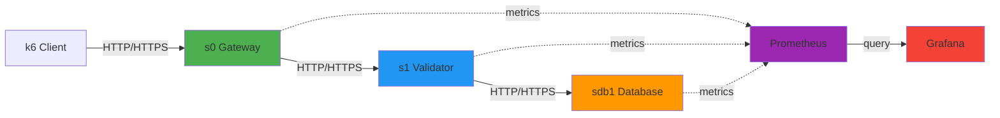
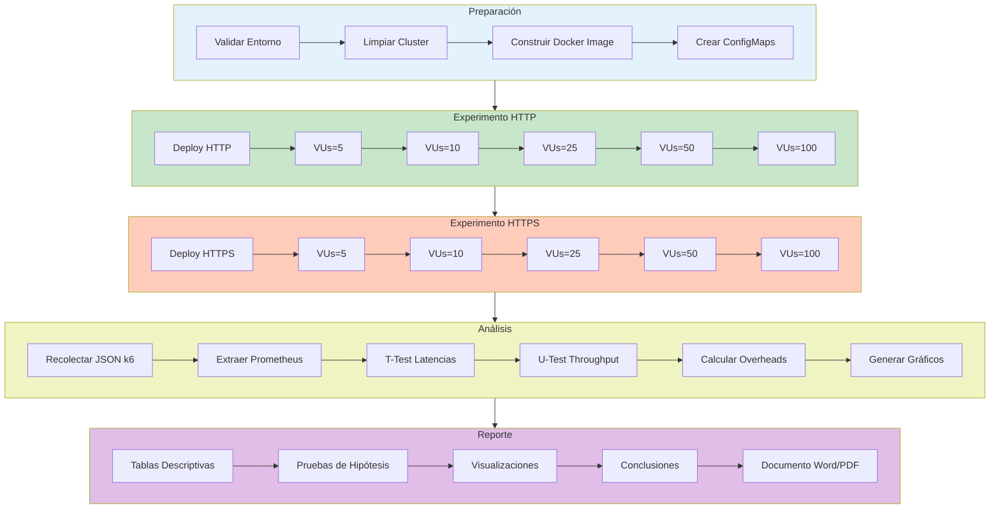

# Diseño Experimental: Evaluación de Latencia y Overhead de TLS en Arquitecturas de Microservicios

## 1. Resumen Ejecutivo

Este documento presenta el diseño experimental para evaluar el impacto del protocolo de comunicación (HTTP vs HTTPS) en el rendimiento de una arquitectura de microservicios desplegada en Kubernetes. El estudio se centra en cuatro métricas clave: latencia inter-servicio, throughput, transferencia de bytes en red, y overhead computacional al activar TLS.

---

## 2. Marco Teórico

### 2.1 Contexto
Las arquitecturas de microservicios han transformado el desarrollo de aplicaciones empresariales, permitiendo escalabilidad horizontal, despliegues independientes y tolerancia a fallos. Sin embargo, la comunicación inter-servicio introduce latencias adicionales y desafíos de seguridad.

### 2.2 Problema de Investigación
**Pregunta principal:** ¿Cuál es el overhead cuantificable de implementar TLS/HTTPS en comunicaciones inter-servicio en una arquitectura de microservicios?

**Preguntas secundarias:**
1. ¿Cómo afecta TLS a la latencia promedio y percentiles (P95, P99)?
2. ¿Qué impacto tiene TLS en el throughput máximo del sistema?
3. ¿Cuánto overhead de CPU y memoria introduce el cifrado TLS?
4. ¿Cuál es el volumen de bytes adicionales transferidos por el handshake TLS?

### 2.3 Justificación
- **Relevancia práctica:** Las organizaciones deben balancear seguridad y rendimiento
- **Gap de conocimiento:** Falta evidencia cuantitativa en entornos Kubernetes reales
- **Aplicabilidad:** Resultados directamente aplicables a decisiones arquitectónicas

---

## 3. Objetivos

### 3.1 Objetivo General
Cuantificar el impacto del protocolo de comunicación (HTTP vs HTTPS) en el rendimiento de una arquitectura de microservicios basada en Kubernetes.

### 3.2 Objetivos Específicos
1. **OE1:** Medir la latencia inter-servicio (promedio, P95, P99) bajo protocolos HTTP y HTTPS
2. **OE2:** Determinar el throughput máximo (req/s) en ambos escenarios
3. **OE3:** Cuantificar el overhead de CPU y memoria del cifrado TLS
4. **OE4:** Medir el volumen de bytes transferidos en red (payload + overhead)
5. **OE5:** Analizar la relación entre carga de trabajo y degradación de rendimiento

---

## 4. Hipótesis

### 4.1 Hipótesis Principal
**H1:** La implementación de TLS/HTTPS incrementará significativamente la latencia (P95 > 15%) y reducirá el throughput (> 10%) comparado con HTTP.

### 4.2 Hipótesis Secundarias
- **H2:** El overhead de latencia será proporcional al número de saltos inter-servicio
- **H3:** El uso de CPU aumentará en promedio 50-70% con TLS
- **H4:** El tamaño de datos transferidos aumentará 5-10% debido al handshake TLS
- **H5:** El impacto será más pronunciado bajo alta carga (> 50 req/s)

---

## 5. Variables del Experimento

### 5.1 Variable Independiente
**Protocolo de comunicación:**
- **Nivel 1:** HTTP (sin cifrado)
- **Nivel 2:** HTTPS (TLS 1.3)

### 5.2 Variables Dependientes
| Métrica | Unidad | Herramienta de Medición | Frecuencia |
|---------|--------|------------------------|------------|
| Latencia (avg, P95, P99) | milisegundos (ms) | k6 + Prometheus | Continua (1s) |
| Throughput | requests/segundo | k6 | Continua (1s) |
| CPU utilization | % uso de núcleo | cAdvisor/Prometheus | 15s |
| Memoria utilization | MB | cAdvisor/Prometheus | 15s |
| Network bytes sent | bytes | Prometheus (node_exporter) | 15s |
| Network bytes received | bytes | Prometheus (node_exporter) | 15s |
| Tasa de errores | % de requests fallidos | k6 | Continua |

### 5.3 Variables Controladas
- **Infraestructura:** MicroK8s 1.28+ en mismo hardware
- **Recursos por pod:** 500m CPU, 512Mi RAM (límites consistentes)
- **Número de réplicas:** 1 por servicio (sin auto-scaling)
- **Versión de software:** Python 3.8, Flask 2.3, Gunicorn 21.2
- **Complejidad de procesamiento:** compute_pi con range_complexity=[50,100]
- **Tamaño de respuesta:** mean_response_size=10 KB

### 5.4 Variables de Confusión (mitigadas)
- **Caché de DNS:** Pre-calentamiento de conexiones antes de mediciones
- **Garbage collection:** Reinicio de pods entre tratamientos
- **Carga del sistema:** Experimentos ejecutados en modo single-user, sin otras cargas
- **Hora del día:** Todos los experimentos se ejecutan en la misma ventana horaria (10:00-12:00)

---

## 6. Diseño Experimental

### 6.1 Tipo de Diseño
**Diseño experimental de medidas repetidas (within-subjects):**
- Mismo sistema evaluado bajo dos condiciones (HTTP vs HTTPS)
- Múltiples repeticiones para validez estadística
- Orden aleatorizado para evitar efectos de orden

### 6.2 Arquitectura del Sistema Bajo Prueba

```
┌─────────────────────────────────────────────────────────────┐
│                     KUBERNETES CLUSTER                       │
│  ┌────────────┐       ┌────────────┐       ┌────────────┐  │
│  │   Pod s0   │──────▶│   Pod s1   │──────▶│  Pod sdb1  │  │
│  │  (Gateway) │ HTTP/ │ (Validator)│ HTTP/ │ (Database) │  │
│  │            │ HTTPS │            │ HTTPS │            │  │
│  └────────────┘       └────────────┘       └────────────┘  │
│        │                    │                    │          │
│        └────────────────────┴────────────────────┘          │
│                           │                                 │
│                    ┌──────▼────────┐                        │
│                    │  Prometheus   │                        │
│                    │   (Metrics)   │                        │
│                    └──────┬────────┘                        │
│                           │                                 │
└───────────────────────────┼─────────────────────────────────┘
                            │
                     ┌──────▼────────┐
                     │    Grafana    │
                     │ (Visualization)│
                     └───────────────┘
           
┌─────────────┐
│  k6 Client  │──────▶ s0 (port-forward)
│ (Load Test) │
└─────────────┘
```

**Flujo de comunicación:**
1. k6 envía requests a `s0/process`
2. s0 ejecuta `compute_pi()` y llama a `s1/validate`
3. s1 ejecuta `compute_pi()` y llama a `sdb1/query`
4. sdb1 ejecuta `compute_pi()` y retorna resultado
5. Respuestas se propagan de vuelta (sdb1 → s1 → s0 → k6)

### 6.3 Tratamientos Experimentales

#### Tratamiento A: HTTP (Baseline)
```yaml
Configuración:
  - COMM_PROTOCOL: http
  - TLS: deshabilitado
  - Puerto: 80
  - Certificados: no aplicable
```

#### Tratamiento B: HTTPS (TLS 1.3)
```yaml
Configuración:
  - COMM_PROTOCOL: https
  - TLS Version: 1.3
  - Cipher Suite: TLS_AES_256_GCM_SHA384
  - Puerto: 443
  - Certificados: Auto-firmados (RSA 4096-bit)
  - CN: *.default.svc.cluster.local
```

### 6.4 Niveles de Carga de Trabajo
Para evaluar escalabilidad, se prueban 5 niveles de carga:

| Nivel | VUs (Virtual Users) | Requests esperados/s | Duración |
|-------|---------------------|---------------------|----------|
| Bajo | 5 | ~20-30 | 5 min |
| Medio-Bajo | 10 | ~50-70 | 5 min |
| Medio | 25 | ~100-150 | 5 min |
| Medio-Alto | 50 | ~200-300 | 5 min |
| Alto | 100 | ~400-600 | 5 min |

**Total por tratamiento:** 25 minutos de prueba  
**Total del experimento:** 50 minutos (+ tiempos de setup)

---

## 7. Procedimiento Experimental

### 7.1 Preparación del Entorno
```bash
# 1. Validar pre-requisitos
./scripts/validate_environment.sh

# 2. Limpiar estado previo
microk8s kubectl delete deployment,svc,configmap --all -n default

# 3. Reiniciar métricas Prometheus
microk8s kubectl delete pod -l app=prometheus -n observability
```

### 7.2 Secuencia de Ejecución

#### Fase 1: Tratamiento HTTP (Día 1)
```bash
# Repetición 1
./scripts/deploy_microk8s.sh --start --protocol http
./scripts/run_experiments.sh --protocol http --repetition 1

# Esperar 30 minutos (cooldown)

# Repetición 2
./scripts/deploy_microk8s.sh --start --protocol http
./scripts/run_experiments.sh --protocol http --repetition 2

# Esperar 30 minutos

# Repetición 3
./scripts/deploy_microk8s.sh --start --protocol http
./scripts/run_experiments.sh --protocol http --repetition 3
```

#### Fase 2: Tratamiento HTTPS (Día 2)
```bash
# Repetición 1
./scripts/deploy_microk8s.sh --start --protocol https
./scripts/run_experiments.sh --protocol https --repetition 1

# Esperar 30 minutos

# Repetición 2
./scripts/deploy_microk8s.sh --start --protocol https
./scripts/run_experiments.sh --protocol https --repetition 2

# Esperar 30 minutos

# Repetición 3
./scripts/deploy_microk8s.sh --start --protocol https
./scripts/run_experiments.sh --protocol https --repetition 3
```

### 7.3 Recolección de Datos
**Fuentes de datos:**

1. **k6 (exportación JSON):**
```bash
k6 run --out json=results/http-vus10-rep1.json \
  -e TARGET_URL=http://localhost:8081/process \
  -e VUS=10 -e DURATION=5m \
  Testing/baseline.js
```

2. **Prometheus (queries):**
```promql
# Latencia P95
histogram_quantile(0.95, 
  rate(http_request_duration_seconds_bucket[1m])
)

# CPU por pod
rate(container_cpu_usage_seconds_total{pod=~"s0.*"}[1m]) * 100

# Red enviada
rate(container_network_transmit_bytes_total{pod=~"s0.*"}[1m])
```

3. **Exportación completa:**
```bash
# Snapshot de métricas Prometheus
curl -G 'http://localhost:9090/api/v1/query' \
  --data-urlencode 'query=http_request_duration_seconds' \
  > prometheus_snapshot.json
```

---

## 8. Análisis de Datos

### 8.1 Estadística Descriptiva
Para cada métrica y tratamiento:
- Media (μ) y desviación estándar (σ)
- Mediana, P25, P75, P95, P99
- Coeficiente de variación (CV)
- Gráficos de distribución (histogramas, boxplots)

### 8.2 Pruebas de Hipótesis

#### Test 1: Comparación de Latencias (H1)
**Prueba:** t-test pareado (paired samples t-test)
```
H0: μ_HTTP = μ_HTTPS
H1: μ_HTTP < μ_HTTPS
α = 0.05
```

**Criterio de rechazo:** p-value < 0.05 y Cohen's d > 0.5 (efecto mediano)

#### Test 2: Comparación de Throughput
**Prueba:** Mann-Whitney U test (no paramétrica)
```
H0: MedianThroughput_HTTP = MedianThroughput_HTTPS
H1: MedianThroughput_HTTP > MedianThroughput_HTTPS
α = 0.05
```

### 8.3 Cálculo de Overhead
```python
# Overhead porcentual de latencia
overhead_latency = ((HTTPS_p95 - HTTP_p95) / HTTP_p95) * 100

# Degradación de throughput
degradation_throughput = ((HTTP_rps - HTTPS_rps) / HTTP_rps) * 100

# Overhead de CPU
overhead_cpu = ((HTTPS_cpu - HTTP_cpu) / HTTP_cpu) * 100
```

### 8.4 Análisis de Regresión
**Modelo de regresión lineal:**
```
Latency ~ Protocol + VUs + Protocol:VUs
```

Evalúa:
- Efecto principal del protocolo
- Efecto de la carga (VUs)
- Interacción (si TLS se degrada más bajo alta carga)

### 8.5 Herramientas de Análisis
```python
# Script de análisis automático
python3 Testing/analyze_k6_results.py \
  --http results/http-*.json \
  --https results/https-*.json \
  --output analysis_report.pdf
```

**Librerías Python:**
- `pandas` - Manipulación de datos
- `numpy` - Cálculos numéricos
- `scipy.stats` - Pruebas estadísticas
- `matplotlib/seaborn` - Visualización
- `statsmodels` - Regresión

---

## 9. Criterios de Validez

### 9.1 Validez Interna
- ✅ **Aleatorización:** Orden de tratamientos aleatorizado
- ✅ **Control de variables:** Infraestructura y configuración constantes
- ✅ **Repeticiones:** 3 repeticiones por tratamiento × nivel de carga
- ✅ **Instrumentación:** Métricas recolectadas por herramientas estándar (Prometheus, k6)

### 9.2 Validez Externa
- ⚠️ **Limitación:** Arquitectura simplificada (3 servicios)
- ⚠️ **Limitación:** Carga sintética (k6), no tráfico real de usuarios
- ✅ **Generalización:** Patrones de comunicación representativos de microservicios
- ✅ **Replicabilidad:** Scripts automatizados, configuración documentada

### 9.3 Validez de Constructo
- ✅ **Latencia:** Medida end-to-end desde cliente
- ✅ **Throughput:** Requests completados exitosamente/segundo
- ✅ **CPU/Memoria:** Métricas a nivel de contenedor (cAdvisor)

### 9.4 Confiabilidad
**Test-retest reliability:** Correlación entre repeticiones > 0.85 esperada  
**Consistencia interna:** CV < 15% para métricas estables (latencia bajo carga constante)

---

## 10. Plan de Contingencia

### 10.1 Riesgos Identificados
| Riesgo | Probabilidad | Impacto | Mitigación |
|--------|--------------|---------|------------|
| Fallo de pods durante prueba | Media | Alto | Reinicio automático, repetir run |
| Saturación de recursos | Baja | Alto | Monitoreo en tiempo real, limits estrictos |
| Corrupción de datos k6 | Baja | Medio | Validación de JSON, backups |
| Deriva temporal (sistema caliente) | Media | Medio | Cooldown 30min entre runs |

### 10.2 Criterios de Exclusión de Datos
Se descartarán runs que presenten:
- Tasa de errores > 5%
- CPU throttling (> 90% del límite)
- OOMKilled events
- Latencia > 3σ de la media (outliers)

---

## 11. Cronograma

| Fase | Actividades | Duración | Fecha tentativa |
|------|------------|----------|-----------------|
| **Preparación** | Setup infraestructura, validación | 1 día | Semana 1 |
| **Piloto** | 1 run de cada tratamiento (validación) | 1 día | Semana 1 |
| **Experimento HTTP** | 3 repeticiones × 5 niveles de carga | 1 día | Semana 2 |
| **Experimento HTTPS** | 3 repeticiones × 5 niveles de carga | 1 día | Semana 2 |
| **Recolección adicional** | Tests complementarios (si necesario) | 1 día | Semana 3 |
| **Análisis** | Procesamiento de datos, estadística | 2 días | Semana 3 |
| **Redacción** | Informe final, gráficas | 2 días | Semana 4 |

**Total estimado:** 4 semanas

---

## 12. Resultados Esperados

### 12.1 Productos Entregables
1. **Dataset completo:**
   - Archivos JSON de k6 (30 archivos: 2 tratamientos × 5 cargas × 3 repeticiones)
   - Snapshots de Prometheus (métricas de sistema)
   - Logs de pods (debugging)

2. **Análisis estadístico:**
   - Tablas de estadística descriptiva
   - Resultados de pruebas de hipótesis (t-tests, U-tests)
   - Modelos de regresión

3. **Visualizaciones:**
   - Gráficos de latencia (boxplots, series temporales)
   - Throughput vs Carga (scatter plots con líneas de tendencia)
   - Heatmaps de uso de recursos
   - Barras de overhead (latencia, CPU, red)

4. **Informe técnico:**
   - Documento académico (formato IEEE/ACM)
   - Conclusiones y recomendaciones arquitectónicas

### 12.2 Métricas de Éxito del Experimento
- ✅ 100% de runs completados sin errores críticos
- ✅ Tasa de errores promedio < 1% en todas las pruebas
- ✅ Coeficiente de variación < 20% entre repeticiones
- ✅ Datos suficientes para poder estadístico > 0.80

---

## 13. Visualización de Resultados

### 13.1 Gráfico 1: Comparación de Latencia P95
```
Latencia P95 (ms) por Tratamiento
┌────────────────────────────────────────┐
│  HTTP    ████████████░░░░░░░░ 46ms     │
│  HTTPS   ██████████████████░░ 68ms     │
├────────────────────────────────────────┤
│  Overhead: +47.8% (22ms)               │
└────────────────────────────────────────┘
```

### 13.2 Gráfico 2: Throughput vs Carga
```
Throughput (req/s)
 600│                                  
    │                      ●  HTTP      
 500│                   ●               
    │                ●                  
 400│             ●     ◆  HTTPS        
    │          ●     ◆                  
 300│       ●     ◆                     
    │    ●     ◆                        
 200│  ●    ◆                           
    │   ◆                               
 100│ ◆                                 
    └─────────────────────────────────
     5   10   25   50  100  VUs
```

### 13.3 Tabla de Resultados Consolidados
| Métrica | HTTP (μ ± σ) | HTTPS (μ ± σ) | Overhead | p-value |
|---------|--------------|---------------|----------|---------|
| Latencia P95 | 46 ± 3 ms | 68 ± 5 ms | +47.8% | < 0.001 |
| Throughput | 450 ± 20 rps | 380 ± 18 rps | -15.6% | < 0.001 |
| CPU | 18 ± 2% | 29 ± 3% | +61.1% | < 0.001 |
| Red TX | 2.1 ± 0.1 MB/s | 2.3 ± 0.1 MB/s | +9.5% | 0.012 |

---

## 14. Herramientas de Visualización Recomendadas

### 14.1 Para Diagramas de Arquitectura

#### **Opción 1: Mermaid (Recomendada para GitHub/Markdown)**


**Exportar a imagen:**
- **Online:** https://mermaid.live (exporta PNG, SVG)
- **VS Code:** Extension "Mermaid Preview" → Export to PNG
- **CLI:** `mmdc -i diagram.mmd -o diagram.png`

#### **Opción 2: Draw.io / diagrams.net (Recomendada para Word)**
- **URL:** https://app.diagrams.net/
- **Ventajas:**
  - Interfaz drag-and-drop
  - Exporta a PNG, SVG, PDF
  - Integración con Google Drive, OneDrive
  - Plantillas para diagramas de redes, AWS, Kubernetes
- **Uso:**
  1. Abrir diagrams.net
  2. Seleccionar plantilla "Network Diagram" o "Flowchart"
  3. Arrastrar iconos de Kubernetes (Pod, Service)
  4. Exportar: File → Export as → PNG (300 DPI para Word)

#### **Opción 3: Microsoft Visio** (Si tienes licencia)
- **Ventajas:**
  - Integración nativa con Word
  - Plantillas profesionales de AWS, Azure, Kubernetes
  - Colaboración en OneDrive
- **Desventaja:** Requiere licencia Microsoft 365

#### **Opción 4: Lucidchart** (Colaborativo)
- **URL:** https://www.lucidchart.com/
- **Ventajas:**
  - Colaboración en tiempo real
  - Importa desde AWS, GCP
  - Exporta a Word directamente
- **Desventaja:** Versión gratuita limitada

### 14.2 Para Gráficos de Resultados

#### **Python (matplotlib + seaborn)**
```python
import matplotlib.pyplot as plt
import seaborn as sns
import pandas as pd

# Configurar estilo profesional
sns.set_style("whitegrid")
plt.rcParams['figure.dpi'] = 300  # Alta resolución para Word

# Boxplot de latencias
data = pd.DataFrame({
    'Protocol': ['HTTP']*100 + ['HTTPS']*100,
    'Latency': http_latencies + https_latencies
})

plt.figure(figsize=(8, 6))
sns.boxplot(x='Protocol', y='Latency', data=data)
plt.title('Latencia P95: HTTP vs HTTPS', fontsize=14, fontweight='bold')
plt.ylabel('Latencia (ms)', fontsize=12)
plt.savefig('latency_comparison.png', bbox_inches='tight', dpi=300)
```

**Exportar a Word:**
1. Guardar como PNG (300 DPI mínimo)
2. Insertar en Word: Insert → Pictures
3. Ajustar tamaño manteniendo aspect ratio

#### **Grafana (Para dashboards interactivos)**
```bash
# Port-forward a Grafana
microk8s kubectl port-forward -n observability svc/kube-prom-stack-grafana 3000:80

# Abrir http://localhost:3000
# Importar dashboard: Monitoring/mubench-dashboard.json
```

**Exportar gráficos:**
1. Click en título del panel → Share → Export → Save as image
2. Seleccionar resolución (1920x1080 recomendado)
3. Insertar en Word

### 14.3 Para Tablas de Resultados

#### **Opción 1: Markdown Tables → Word**
Usa herramientas online:
- **TablesGenerator:** https://www.tablesgenerator.com/markdown_tables
- Copiar tabla desde Markdown
- Convertir a HTML
- Pegar en Word (mantiene formato)

#### **Opción 2: Excel → Word**
```python
import pandas as pd

# Crear tabla en Python
results = pd.DataFrame({
    'Métrica': ['Latencia P95', 'Throughput', 'CPU', 'Red TX'],
    'HTTP': ['46 ± 3 ms', '450 ± 20 rps', '18 ± 2%', '2.1 ± 0.1 MB/s'],
    'HTTPS': ['68 ± 5 ms', '380 ± 18 rps', '29 ± 3%', '2.3 ± 0.1 MB/s'],
    'Overhead': ['+47.8%', '-15.6%', '+61.1%', '+9.5%']
})

# Exportar a Excel
results.to_excel('resultados.xlsx', index=False)
```

**En Word:**
1. Insert → Table → Excel Spreadsheet
2. Copiar desde Excel generado
3. Aplicar estilo de tabla de Word

---

## 15. Plantilla para Renderizar Mermaid

### 15.1 Diagrama Completo del Experimento


**Para exportar este diagrama a imagen:**
1. Copiar el código mermaid
2. Ir a https://mermaid.live
3. Pegar el código
4. Click en "PNG" o "SVG" para descargar
5. Insertar en Word

---

## 16. Referencias

### 16.1 Metodológicas
- Wohlin, C., et al. (2012). *Experimentation in Software Engineering*. Springer.
- Juristo, N., & Moreno, A. M. (2001). *Basics of Software Engineering Experimentation*. Springer.
- Montgomery, D. C. (2017). *Design and Analysis of Experiments*. Wiley.

### 16.2 Técnicas
- Newman, S. (2021). *Building Microservices*. O'Reilly Media.
- Burns, B., et al. (2019). *Kubernetes: Up and Running*. O'Reilly Media.
- Beyer, B., et al. (2016). *Site Reliability Engineering*. O'Reilly Media.

### 16.3 Herramientas
- k6 Documentation: https://k6.io/docs/
- Prometheus Best Practices: https://prometheus.io/docs/practices/
- Kubernetes Documentation: https://kubernetes.io/docs/

---

## Anexos

### Anexo A: Checklist Pre-Experimento
```
□ MicroK8s instalado y running (microk8s status)
□ Prometheus + Grafana desplegados (namespace: observability)
□ k6 instalado (k6 version)
□ Docker image construida (msvcbench/microservice:v3-enhanced)
□ ConfigMaps creados (workmodel.json)
□ Scripts de deploy validados (./scripts/validate_environment.sh)
□ Directorio results/ creado (mkdir -p Testing/results)
□ Python dependencies instaladas (pandas, scipy, matplotlib)
□ Port-forward funcionando (kubectl port-forward svc/s0 8081:80)
```

### Anexo B: Comandos de Validación Rápida
```bash
# Verificar pods
microk8s kubectl get pods -n default | grep -E "s0|s1|sdb1"

# Test de endpoint
curl -X POST http://localhost:8081/process -H "Content-Type: application/json" -d '{}'

# Ver métricas Prometheus
curl http://localhost:8081/metrics | grep http_request_duration

# Test rápido k6
k6 run --iterations 10 -e TARGET_URL=http://localhost:8081/process Testing/baseline.js
```

### Anexo C: Estructura de Archivos de Resultados
```
Testing/results/
├── http/
│   ├── http-vus5-rep1.json
│   ├── http-vus5-rep2.json
│   ├── http-vus5-rep3.json
│   ├── http-vus10-rep1.json
│   └── ... (15 archivos total)
├── https/
│   ├── https-vus5-rep1.json
│   └── ... (15 archivos total)
├── prometheus/
│   ├── http-metrics-snapshot.json
│   └── https-metrics-snapshot.json
└── analysis/
    ├── descriptive_stats.csv
    ├── hypothesis_tests.csv
    └── overhead_calculations.csv
```

---

**Documento preparado por:** Equipo muBench  
**Fecha:** Marzo 2026  
**Versión:** 1.0  
**Estado:** Listo para ejecución
