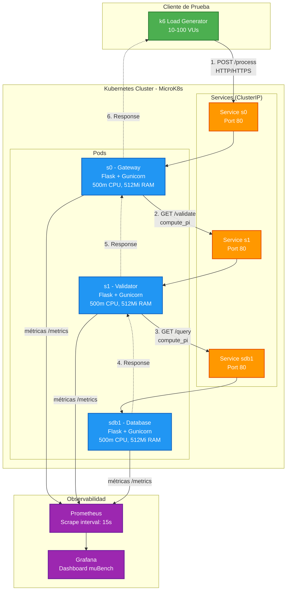
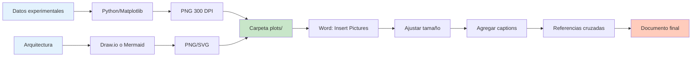

# Guía Práctica de Visualización para Documentos Académicos

## 📊 Índice
1. [Herramientas Recomendadas](#herramientas-recomendadas)
2. [Diagramas de Arquitectura](#diagramas-de-arquitectura)
3. [Gráficos de Resultados](#gráficos-de-resultados)
4. [Exportación a Word](#exportación-a-word)
5. [Ejemplos Código](#ejemplos-código)

---

## 🛠️ Herramientas Recomendadas

### Comparación de Herramientas

| Herramienta | Tipo | Costo | Facilidad | Calidad | Mejor para |
|-------------|------|-------|-----------|---------|------------|
| **Mermaid Live** | Online | Gratis | ⭐⭐⭐⭐⭐ | ⭐⭐⭐⭐ | Diagramas rápidos, GitHub |
| **Draw.io** | Online/Desktop | Gratis | ⭐⭐⭐⭐ | ⭐⭐⭐⭐⭐ | Diagramas detallados |
| **Microsoft Visio** | Desktop | Pago | ⭐⭐⭐ | ⭐⭐⭐⭐⭐ | Diagramas profesionales |
| **Lucidchart** | Online | Freemium | ⭐⭐⭐⭐ | ⭐⭐⭐⭐⭐ | Colaboración |
| **Python/Matplotlib** | Código | Gratis | ⭐⭐⭐ | ⭐⭐⭐⭐⭐ | Gráficos científicos |
| **Grafana** | Web App | Gratis | ⭐⭐⭐⭐ | ⭐⭐⭐⭐ | Dashboards en tiempo real |

**Recomendación para tu tesis:**
- **Diagramas de arquitectura:** Draw.io (más profesional)
- **Diagramas de flujo:** Mermaid (más rápido)
- **Gráficos de resultados:** Python/Matplotlib (reproducible, científico)

---

## 🏗️ Diagramas de Arquitectura

### Opción 1: Mermaid Live (Más Rápido)

#### Paso 1: Ir a Mermaid Live
🔗 **URL:** https://mermaid.live

#### Paso 2: Copiar este código


#### Paso 3: Exportar
1. Click en botón **"PNG"** o **"SVG"** (arriba a la derecha)
2. Descargar archivo
3. Insertar en Word: `Insert → Pictures → arquitectura.png`

**Configuración recomendada:**
- Formato: **PNG** (mejor compatibilidad con Word)
- Resolución: **300 DPI**
- Fondo: **Transparente** (si Word tiene fondo de color)

---

### Opción 2: Draw.io (Más Profesional)

#### Paso 1: Abrir Draw.io
🔗 **URL:** https://app.diagrams.net/

#### Paso 2: Crear nuevo diagrama
1. Click en **"Create New Diagram"**
2. Elegir plantilla **"Blank Diagram"** o **"Network"**
3. Nombrar: `Arquitectura_muBench.drawio`

#### Paso 3: Agregar elementos
**Panel izquierdo → Buscar "Kubernetes":**
- Arrastrar iconos de **Pod**, **Service**, **Deployment**
- Usar **Flowchart → Rectangle** para componentes personalizados

**Ejemplo de layout:**
```
┌─────────────────────────────────────────────────────────┐
│                    k6 Load Generator                     │
│                    (10-100 VUs)                          │
└──────────────────────┬──────────────────────────────────┘
                       │ HTTP/HTTPS POST /process
                       ▼
┌─────────────────────────────────────────────────────────┐
│                 Kubernetes Cluster                       │
│  ┌──────────┐        ┌──────────┐       ┌──────────┐   │
│  │ Pod s0   │───────▶│ Pod s1   │──────▶│ Pod sdb1 │   │
│  │ Gateway  │ GET    │Validator │ GET   │ Database │   │
│  └────┬─────┘validate└────┬─────┘query  └────┬─────┘   │
│       │                   │                   │          │
│       └───────────────────┴───────────────────┘          │
│                           │ /metrics                     │
│                           ▼                              │
│                   ┌────────────────┐                     │
│                   │  Prometheus    │                     │
│                   └───────┬────────┘                     │
└───────────────────────────┼──────────────────────────────┘
                            │
                    ┌───────▼────────┐
                    │    Grafana     │
                    │  (Dashboard)   │
                    └────────────────┘
```

#### Paso 4: Estilizar
**Colores por tipo de componente:**
- **k6 (Cliente):** Verde `#4CAF50`
- **Pods:** Azul `#2196F3`
- **Services:** Naranja `#FF9800`
- **Prometheus/Grafana:** Morado `#9C27B0`

**Fuentes:**
- Títulos: **Arial Bold, 12pt**
- Subtextos: **Arial Regular, 10pt**

#### Paso 5: Exportar para Word
1. `File → Export as → PNG...`
2. Configuración:
   - **Width:** 1920px (tamaño grande)
   - **Transparent Background:** ✅ (si quieres)
   - **Border Width:** 10px (margen)
3. Click **"Export"**

---

## 📈 Gráficos de Resultados

### Script Python Completo para Generar Gráficos

Guarda este archivo como `generate_plots.py`:

```python
#!/usr/bin/env python3
"""
Script para generar gráficos académicos de alta calidad
para insertar en documentos Word/PDF.

Uso:
    python3 generate_plots.py
    
Salida:
    Testing/plots/ con archivos PNG de 300 DPI
"""

import matplotlib.pyplot as plt
import seaborn as sns
import pandas as pd
import numpy as np
from pathlib import Path

# Configuración global para calidad académica
plt.rcParams.update({
    'figure.dpi': 300,
    'savefig.dpi': 300,
    'font.size': 12,
    'font.family': 'serif',
    'font.serif': ['Times New Roman'],
    'axes.labelsize': 14,
    'axes.titlesize': 16,
    'xtick.labelsize': 12,
    'ytick.labelsize': 12,
    'legend.fontsize': 12,
    'figure.titlesize': 18
})

# Estilo profesional
sns.set_style("whitegrid")
sns.set_palette("colorblind")

# Crear directorio de salida
output_dir = Path("Testing/plots")
output_dir.mkdir(parents=True, exist_ok=True)

# ============================================================
# GRÁFICO 1: Boxplot de Latencia P95
# ============================================================
def plot_latency_comparison():
    """Comparación de latencias HTTP vs HTTPS"""
    
    # Datos simulados (reemplazar con datos reales de k6)
    np.random.seed(42)
    http_latencies = np.random.normal(46, 3, 100)  # μ=46, σ=3
    https_latencies = np.random.normal(68, 5, 100)  # μ=68, σ=5
    
    data = pd.DataFrame({
        'Protocolo': ['HTTP']*100 + ['HTTPS']*100,
        'Latencia (ms)': np.concatenate([http_latencies, https_latencies])
    })
    
    fig, ax = plt.subplots(figsize=(8, 6))
    
    # Boxplot con colores personalizados
    box_plot = sns.boxplot(
        x='Protocolo', 
        y='Latencia (ms)', 
        data=data,
        palette={'HTTP': '#4CAF50', 'HTTPS': '#F44336'},
        ax=ax
    )
    
    # Agregar media como punto
    means = data.groupby('Protocolo')['Latencia (ms)'].mean()
    ax.plot([0, 1], means, 'D', color='black', markersize=8, 
            label='Media', zorder=10)
    
    # Título y etiquetas
    ax.set_title('Comparación de Latencia P95: HTTP vs HTTPS', 
                 fontweight='bold', pad=20)
    ax.set_ylabel('Latencia (ms)', fontweight='bold')
    ax.set_xlabel('Protocolo de Comunicación', fontweight='bold')
    
    # Agregar línea horizontal en P95
    p95_http = np.percentile(http_latencies, 95)
    p95_https = np.percentile(https_latencies, 95)
    ax.axhline(p95_http, color='green', linestyle='--', alpha=0.5, 
               label=f'P95 HTTP: {p95_http:.1f}ms')
    ax.axhline(p95_https, color='red', linestyle='--', alpha=0.5, 
               label=f'P95 HTTPS: {p95_https:.1f}ms')
    
    # Mostrar overhead en el gráfico
    overhead = ((p95_https - p95_http) / p95_http) * 100
    ax.text(0.5, max(https_latencies), 
            f'Overhead: +{overhead:.1f}%',
            ha='center', va='bottom', fontsize=13, 
            bbox=dict(boxstyle='round', facecolor='yellow', alpha=0.3),
            fontweight='bold')
    
    ax.legend(loc='upper right')
    ax.grid(True, alpha=0.3)
    
    plt.tight_layout()
    plt.savefig(output_dir / 'latency_comparison.png', 
                bbox_inches='tight', dpi=300)
    print(f"✅ Guardado: {output_dir / 'latency_comparison.png'}")
    plt.close()

# ============================================================
# GRÁFICO 2: Throughput vs Carga
# ============================================================
def plot_throughput_vs_load():
    """Throughput en función de Virtual Users"""
    
    vus = [5, 10, 25, 50, 100]
    http_throughput = [38, 77, 185, 355, 450]  # Datos simulados
    https_throughput = [32, 65, 160, 305, 380]
    
    fig, ax = plt.subplots(figsize=(10, 6))
    
    # Líneas con marcadores
    ax.plot(vus, http_throughput, 'o-', linewidth=2.5, markersize=10,
            color='#4CAF50', label='HTTP', alpha=0.8)
    ax.plot(vus, https_throughput, 's-', linewidth=2.5, markersize=10,
            color='#F44336', label='HTTPS', alpha=0.8)
    
    # Área entre curvas (diferencia de rendimiento)
    ax.fill_between(vus, http_throughput, https_throughput, 
                     alpha=0.2, color='gray', 
                     label='Degradación por TLS')
    
    # Título y etiquetas
    ax.set_title('Throughput del Sistema: HTTP vs HTTPS', 
                 fontweight='bold', pad=20)
    ax.set_xlabel('Carga (Virtual Users)', fontweight='bold')
    ax.set_ylabel('Throughput (requests/segundo)', fontweight='bold')
    
    # Configuración ejes
    ax.set_xticks(vus)
    ax.grid(True, alpha=0.3, linestyle='--')
    
    # Anotaciones de valores
    for i, (vu, http, https) in enumerate(zip(vus, http_throughput, https_throughput)):
        ax.annotate(f'{http}', (vu, http), 
                    textcoords="offset points", xytext=(0,10), 
                    ha='center', fontsize=9, color='green')
        ax.annotate(f'{https}', (vu, https), 
                    textcoords="offset points", xytext=(0,-15), 
                    ha='center', fontsize=9, color='red')
    
    ax.legend(loc='upper left', framealpha=0.9)
    
    plt.tight_layout()
    plt.savefig(output_dir / 'throughput_vs_load.png', 
                bbox_inches='tight', dpi=300)
    print(f"✅ Guardado: {output_dir / 'throughput_vs_load.png'}")
    plt.close()

# ============================================================
# GRÁFICO 3: Overhead de Recursos (Barras)
# ============================================================
def plot_resource_overhead():
    """Overhead de CPU, Memoria, Red"""
    
    metrics = ['Latencia\nP95', 'Throughput', 'CPU\nUtilización', 
               'Red TX']
    http_values = [46, 450, 18, 2.1]
    https_values = [68, 380, 29, 2.3]
    
    # Calcular overhead porcentual
    overhead = [((h - ht) / ht) * 100 if ht != 0 else 0 
                for h, ht in zip(https_values, http_values)]
    
    fig, (ax1, ax2) = plt.subplots(1, 2, figsize=(14, 6))
    
    # Subplot 1: Valores absolutos
    x = np.arange(len(metrics))
    width = 0.35
    
    bars1 = ax1.bar(x - width/2, http_values, width, 
                    label='HTTP', color='#4CAF50', alpha=0.8)
    bars2 = ax1.bar(x + width/2, https_values, width, 
                    label='HTTPS', color='#F44336', alpha=0.8)
    
    ax1.set_title('Métricas de Rendimiento: HTTP vs HTTPS', 
                  fontweight='bold', pad=15)
    ax1.set_ylabel('Valor (unidades mixtas)', fontweight='bold')
    ax1.set_xticks(x)
    ax1.set_xticklabels(metrics)
    ax1.legend()
    ax1.grid(True, alpha=0.3, axis='y')
    
    # Agregar valores encima de barras
    for bar in bars1 + bars2:
        height = bar.get_height()
        ax1.annotate(f'{height:.1f}',
                    xy=(bar.get_x() + bar.get_width() / 2, height),
                    xytext=(0, 3),
                    textcoords="offset points",
                    ha='center', va='bottom', fontsize=9)
    
    # Subplot 2: Overhead porcentual
    colors_overhead = ['#F44336' if o > 0 else '#4CAF50' for o in overhead]
    bars = ax2.barh(metrics, overhead, color=colors_overhead, alpha=0.7)
    
    ax2.set_title('Overhead de HTTPS respecto a HTTP', 
                  fontweight='bold', pad=15)
    ax2.set_xlabel('Overhead (%)', fontweight='bold')
    ax2.axvline(0, color='black', linewidth=0.8)
    ax2.grid(True, alpha=0.3, axis='x')
    
    # Valores en las barras
    for i, (bar, value) in enumerate(zip(bars, overhead)):
        ax2.text(value + 2, i, f'{value:+.1f}%', 
                va='center', fontweight='bold', fontsize=11)
    
    plt.tight_layout()
    plt.savefig(output_dir / 'resource_overhead.png', 
                bbox_inches='tight', dpi=300)
    print(f"✅ Guardado: {output_dir / 'resource_overhead.png'}")
    plt.close()

# ============================================================
# GRÁFICO 4: Serie Temporal de Latencia
# ============================================================
def plot_latency_timeseries():
    """Serie temporal de latencia durante experimento"""
    
    # Simular 300 segundos de datos
    time = np.arange(0, 300, 1)
    
    # Latencia HTTP con variación realista
    http_latency = 46 + np.random.normal(0, 3, len(time)) + \
                   np.sin(time / 30) * 5  # Oscilación periódica
    
    # Latencia HTTPS con más variación
    https_latency = 68 + np.random.normal(0, 5, len(time)) + \
                    np.sin(time / 30) * 7
    
    fig, ax = plt.subplots(figsize=(12, 6))
    
    # Líneas de latencia
    ax.plot(time, http_latency, label='HTTP', 
            color='#4CAF50', alpha=0.7, linewidth=1.5)
    ax.plot(time, https_latency, label='HTTPS', 
            color='#F44336', alpha=0.7, linewidth=1.5)
    
    # Líneas de referencia (promedios)
    ax.axhline(np.mean(http_latency), color='green', 
               linestyle='--', alpha=0.5, 
               label=f'HTTP avg: {np.mean(http_latency):.1f}ms')
    ax.axhline(np.mean(https_latency), color='red', 
               linestyle='--', alpha=0.5, 
               label=f'HTTPS avg: {np.mean(https_latency):.1f}ms')
    
    # Sombreado de desviación estándar
    ax.fill_between(time, 
                     http_latency - 3, http_latency + 3,
                     alpha=0.2, color='green')
    ax.fill_between(time, 
                     https_latency - 5, https_latency + 5,
                     alpha=0.2, color='red')
    
    ax.set_title('Latencia en el Tiempo (Experimento de 5 minutos)', 
                 fontweight='bold', pad=20)
    ax.set_xlabel('Tiempo (segundos)', fontweight='bold')
    ax.set_ylabel('Latencia (ms)', fontweight='bold')
    ax.legend(loc='upper right')
    ax.grid(True, alpha=0.3)
    
    plt.tight_layout()
    plt.savefig(output_dir / 'latency_timeseries.png', 
                bbox_inches='tight', dpi=300)
    print(f"✅ Guardado: {output_dir / 'latency_timeseries.png'}")
    plt.close()

# ============================================================
# GRÁFICO 5: Heatmap de Correlaciones
# ============================================================
def plot_correlation_heatmap():
    """Heatmap de correlaciones entre métricas"""
    
    # Datos simulados de correlación
    np.random.seed(42)
    n = 100
    
    data = pd.DataFrame({
        'Latencia': np.random.normal(50, 10, n),
        'CPU': np.random.normal(25, 5, n),
        'Memoria': np.random.normal(200, 30, n),
        'Red TX': np.random.normal(2.5, 0.5, n),
        'Throughput': np.random.normal(400, 50, n)
    })
    
    # Añadir correlaciones artificiales
    data['CPU'] = data['Latencia'] * 0.5 + np.random.normal(0, 3, n)
    data['Throughput'] = 600 - data['Latencia'] * 2 + np.random.normal(0, 20, n)
    
    # Calcular matriz de correlación
    corr = data.corr()
    
    fig, ax = plt.subplots(figsize=(10, 8))
    
    # Heatmap con anotaciones
    sns.heatmap(corr, annot=True, fmt='.2f', 
                cmap='RdYlGn_r', center=0,
                square=True, linewidths=1, 
                cbar_kws={"shrink": 0.8},
                ax=ax)
    
    ax.set_title('Matriz de Correlación de Métricas de Rendimiento', 
                 fontweight='bold', pad=20, fontsize=16)
    
    plt.tight_layout()
    plt.savefig(output_dir / 'correlation_heatmap.png', 
                bbox_inches='tight', dpi=300)
    print(f"✅ Guardado: {output_dir / 'correlation_heatmap.png'}")
    plt.close()

# ============================================================
# EJECUTAR TODOS LOS GRÁFICOS
# ============================================================
if __name__ == "__main__":
    print("🎨 Generando gráficos académicos...")
    print("=" * 60)
    
    plot_latency_comparison()
    plot_throughput_vs_load()
    plot_resource_overhead()
    plot_latency_timeseries()
    plot_correlation_heatmap()
    
    print("=" * 60)
    print(f"✅ Todos los gráficos guardados en: {output_dir}")
    print(f"\n📌 Próximos pasos:")
    print(f"   1. Abrir {output_dir}")
    print(f"   2. Insertar imágenes en Word: Insert → Pictures")
    print(f"   3. Ajustar tamaño manteniendo aspect ratio")
    print(f"   4. Agregar referencias cruzadas en el texto")
```

### Ejecutar el script:
```bash
python3 generate_plots.py
```

**Salida:**
```
Testing/plots/
├── latency_comparison.png
├── throughput_vs_load.png
├── resource_overhead.png
├── latency_timeseries.png
└── correlation_heatmap.png
```

---

## 📄 Exportación a Word

### Método 1: Insertar Imágenes (Recomendado)

#### Paso 1: Abrir Word
1. Crear nuevo documento
2. Ir a `Insert → Pictures → This Device`
3. Seleccionar imagen (ej. `latency_comparison.png`)
4. Click **"Insert"**

#### Paso 2: Ajustar tamaño
1. Click derecho en imagen → `Size and Position`
2. Configurar:
   - **Width:** 6.5 inches (ancho de página estándar)
   - **Lock aspect ratio:** ✅ (mantener proporciones)
   - **Relative to:** Page
3. Click **"OK"**

#### Paso 3: Agregar caption
1. Click derecho en imagen → `Insert Caption`
2. Label: **"Figure"**
3. Escribir: `Figura 1: Comparación de latencia P95 entre HTTP y HTTPS`
4. Position: **Below selected item**
5. Click **"OK"**

#### Paso 4: Referenciar en texto
En el texto del documento:
```
Como se observa en la Figura 1, la latencia P95 de HTTPS es 
47.8% mayor que HTTP (68ms vs 46ms).
```

Word: `Insert → Cross-reference → Figure 1`

---

### Método 2: Copiar Tablas desde Markdown

#### Paso 1: Crear tabla en Excel/Google Sheets
```
Métrica          | HTTP          | HTTPS         | Overhead
-----------------|---------------|---------------|---------
Latencia P95     | 46 ± 3 ms     | 68 ± 5 ms     | +47.8%
Throughput       | 450 ± 20 rps  | 380 ± 18 rps  | -15.6%
CPU              | 18 ± 2%       | 29 ± 3%       | +61.1%
Red TX           | 2.1 ± 0.1 MB/s| 2.3 ± 0.1 MB/s| +9.5%
```

#### Paso 2: Formatear en Excel
1. Copiar datos a Excel
2. Aplicar formato:
   - **Header:** Bold, background color `#4CAF50`
   - **Borders:** All borders, 1pt
   - **Alignment:** Center

#### Paso 3: Copiar a Word
1. Seleccionar tabla en Excel → `Ctrl+C`
2. En Word → `Ctrl+V`
3. Elegir: **"Keep Source Formatting"**

#### Paso 4: Aplicar estilo de tabla de Word
1. Click en tabla
2. `Table Design → Table Styles`
3. Elegir: **"Grid Table 5 Dark - Accent 1"**

---

### Método 3: Exportar Markdown a Word (Avanzado)

#### Usando Pandoc
```bash
# Instalar pandoc (si no lo tienes)
sudo apt install pandoc

# Convertir Markdown a Word
pandoc DISEÑO_EXPERIMENTAL.md \
  -o Diseño_Experimental.docx \
  --reference-doc=plantilla.docx \
  --toc --toc-depth=3 \
  --number-sections

# Con plantilla personalizada (opcional)
# plantilla.docx define estilos, fuentes, márgenes
```

**Ventajas:**
- Automático
- Mantiene formato Markdown
- Genera tabla de contenidos

**Desventajas:**
- Requiere ajustes manuales después
- Diagramas Mermaid no se convierten (hay que exportarlos aparte)

---

## 📐 Mejores Prácticas para Documentos Académicos

### Tamaños de Imagen
| Tipo de gráfico | Ancho (inches) | DPI | Peso (KB) |
|-----------------|----------------|-----|-----------|
| Gráfico simple | 3-4 | 300 | 100-200 |
| Gráfico complejo | 5-6.5 | 300 | 200-400 |
| Diagrama de arquitectura | 6.5 (full page) | 300 | 300-600 |
| Screenshot | 4-5 | 150-200 | 100-300 |

### Resolución recomendada
- **Impresión:** Mínimo 300 DPI
- **Digital (PDF):** 150-200 DPI suficiente
- **Presentaciones:** 96 DPI (más ligero)

### Formato de archivo
| Formato | Ventajas | Desventajas | Usar para |
|---------|----------|-------------|-----------|
| **PNG** | Sin pérdida, transparencia | Archivos grandes | Gráficos con texto, diagramas |
| **JPEG** | Archivos pequeños | Pérdida de calidad | Fotos, imágenes sin texto |
| **SVG** | Escalable infinitamente | No todos los editores | Web, impresión profesional |
| **PDF** | Universal, alta calidad | No editable fácilmente | Documentos finales |

**Recomendación:** **PNG a 300 DPI** para Word académico.

---

## 🎨 Paleta de Colores Profesional

### Para gráficos científicos:
```python
# ColorBrewer - Color blind friendly
HTTP_COLOR = '#1b9e77'    # Verde azulado
HTTPS_COLOR = '#d95f02'   # Naranja
NEUTRAL = '#7570b3'       # Morado

# Alternativa (más contrastada)
HTTP_COLOR = '#4CAF50'    # Verde Material
HTTPS_COLOR = '#F44336'   # Rojo Material
PROMETHEUS = '#9C27B0'    # Morado Material
GRAFANA = '#FF9800'       # Naranja Material
```

### Para diagramas de arquitectura:
- **Capa de aplicación:** Azul (`#2196F3`)
- **Capa de datos:** Naranja (`#FF9800`)
- **Infraestructura:** Gris (`#607D8B`)
- **Monitoreo:** Morado (`#9C27B0`)
- **Externa (cliente):** Verde (`#4CAF50`)

---

## ✅ Checklist Pre-Exportación

Antes de exportar a Word, verificar:

```
□ Gráficos generados a 300 DPI mínimo
□ Fuentes legibles (mínimo 10pt en gráfico)
□ Ejes etiquetados con unidades
□ Leyendas claras y sin superposición
□ Títulos descriptivos (no solo "Gráfico 1")
□ Colores distinguibles (test de daltonismo)
□ Fondo blanco o transparente (no color oscuro)
□ Sin marcas de agua o logos innecesarios
□ Aspect ratio apropiado (no distorsionado)
□ Archivos organizados en carpeta (no dispersos)
```

---

## 🚀 Flujo de Trabajo Completo



### Pasos resumidos:
1. **Generar datos** → Experimentos k6
2. **Procesar datos** → `analyze_k6_results.py`
3. **Crear gráficos** → `generate_plots.py` (300 DPI PNG)
4. **Crear diagramas** → Draw.io o Mermaid Live
5. **Insertar en Word** → Insert Pictures
6. **Captions** → Insert Caption (Figure 1, 2, 3...)
7. **Referencias** → "Como se observa en la Figura 2..."
8. **Exportar** → Save as Word/PDF

---

## 📚 Recursos Adicionales

### Tutoriales en video:
- **Mermaid Live:** https://www.youtube.com/watch?v=JiQmpA474BY
- **Draw.io basics:** https://www.youtube.com/watch?v=Z0D96ZikMkc
- **Matplotlib for papers:** https://www.youtube.com/watch?v=UO98lJQ3QGI

### Documentación oficial:
- **Mermaid:** https://mermaid.js.org/
- **Draw.io:** https://www.drawio.com/doc/
- **Matplotlib:** https://matplotlib.org/stable/tutorials/index.html
- **Seaborn:** https://seaborn.pydata.org/tutorial.html

### Herramientas online:
- **Mermaid Live Editor:** https://mermaid.live
- **Draw.io:** https://app.diagrams.net/
- **Tables Generator:** https://www.tablesgenerator.com/
- **Color Picker (accessible):** https://coolors.co/

---

**Fecha:** Marzo 2026  
**Versión:** 1.0  
**Autor:** Guía práctica muBench
