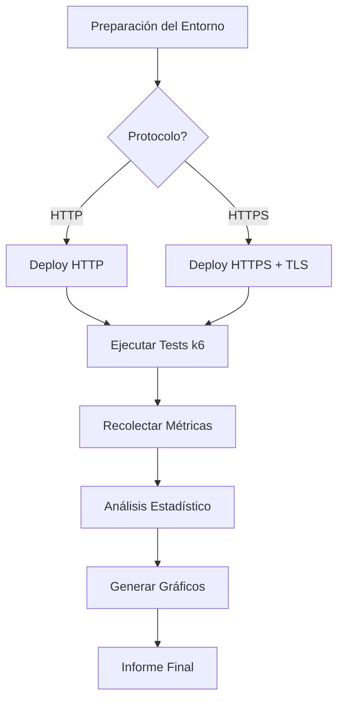
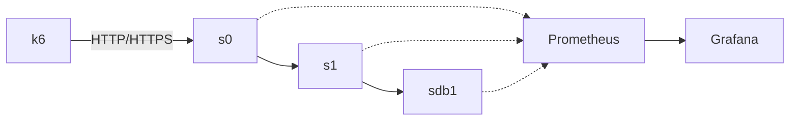

# 📋 Diseño Experimental y Visualización - Guía Rápida

## 📚 Archivos Creados

Este directorio contiene la documentación completa para tu diseño experimental:

### 1. **DISEÑO_EXPERIMENTAL.md** (Documento Principal)
Diseño experimental académico completo con:
- ✅ Marco teórico y justificación
- ✅ Objetivos e hipótesis
- ✅ Variables (independientes, dependientes, controladas)
- ✅ Metodología experimental detallada
- ✅ Procedimiento paso a paso
- ✅ Análisis estadístico planeado
- ✅ Plan de contingencia
- ✅ Cronograma
- ✅ Referencias

**Para incluir en Word:**
1. Abrir `DISEÑO_EXPERIMENTAL.md`
2. Copiar secciones relevantes
3. Pegar en Word (formateará automáticamente)
4. Ajustar estilos (Heading 1, 2, 3...)

### 2. **GUIA_VISUALIZACION.md** (Guía Práctica)
Tutorial paso a paso para crear visualizaciones:
- ⭐ Comparación de herramientas (Mermaid, Draw.io, Visio, Python)
- ⭐ Ejemplos de código Mermaid (listos para copiar)
- ⭐ Tutorial de Draw.io
- ⭐ Script Python completo para generar gráficos
- ⭐ Métodos de exportación a Word
- ⭐ Mejores prácticas académicas
- ⭐ Checklist de calidad

### 3. **Testing/generate_plots.py** (Script Ejecutable)
Script Python que genera 5 gráficos académicos de alta calidad:
1. Boxplot de latencia (HTTP vs HTTPS)
2. Throughput vs Carga (líneas con marcadores)
3. Overhead de recursos (barras comparativas)
4. Serie temporal de latencia
5. Heatmap de correlaciones

---

## 🚀 Inicio Rápido

### Paso 0: Instalar Dependencias (Solo la primera vez)

```bash
# Instalar librerías necesarias para gráficos
pip3 install matplotlib seaborn pandas numpy

# O usando requirements si existe:
# pip3 install -r requirements.txt
```

### Paso 1: Generar Gráficos (Datos Simulados)

```bash
# Ejecutar script de gráficos
cd /home/dwan13/muBench/Testing
python3 generate_plots.py
```

**Salida:**
```
🎨 Generando gráficos académicos...
============================================================
✅ Guardado: plots/latency_comparison.png
✅ Guardado: plots/throughput_vs_load.png
✅ Guardado: plots/resource_overhead.png
✅ Guardado: plots/latency_timeseries.png
✅ Guardado: plots/correlation_heatmap.png
============================================================
✅ Todos los gráficos guardados en: plots
```

### Paso 2: Crear Diagramas de Arquitectura

**Opción A: Mermaid Live (Más Rápido)**
1. Ir a: https://mermaid.live
2. Copiar código de `GUIA_VISUALIZACION.md` (sección "Diagramas de Arquitectura")
3. Pegar en editor online
4. Click en botón **"PNG"** para descargar
5. Guardar como `arquitectura_mubench.png`

**Opción B: Draw.io (Más Profesional)**
1. Ir a: https://app.diagrams.net/
2. Crear nuevo diagrama
3. Usar plantilla "Network" o "Kubernetes"
4. Arrastrar iconos de Pods, Services
5. Exportar: File → Export as → PNG (300 DPI)

### Paso 3: Insertar en Word

1. **Abrir Word** → Crear nuevo documento
2. **Copiar contenido de DISEÑO_EXPERIMENTAL.md** → Pegar en Word
3. **Insertar gráficos:**
   - Insert → Pictures → Seleccionar `plots/*.png`
   - Ajustar ancho: 6.5 inches (full page width)
   - Mantener aspect ratio
4. **Agregar captions:**
   - Click derecho en imagen → Insert Caption
   - Tipo: "Figure"
   - Escribir: "Figura 1: Comparación de latencia..."
5. **Referencias cruzadas en texto:**
   - "Como se observa en la Figura 1..."
   - Insert → Cross-reference → Figure 1

---

## 🛠️ Herramientas Recomendadas

### Para Diagramas
| Herramienta | URL | Ventaja Principal |
|-------------|-----|-------------------|
| **Mermaid Live** | https://mermaid.live | Rápido, basado en código |
| **Draw.io** | https://app.diagrams.net/ | Interfaz drag-and-drop |
| **Lucidchart** | https://www.lucidchart.com/ | Colaboración en tiempo real |

### Para Gráficos
- **Python (Matplotlib)** - Ya incluido en `generate_plots.py`
- **Grafana** - Para capturar dashboards en tiempo real
- **Excel/Google Sheets** - Para tablas comparativas

---

## 📊 Gráficos Generados

### 1. latency_comparison.png
> Boxplot comparando latencia P95 entre HTTP y HTTPS con anotaciones de overhead

**Usar para:** Mostrar impacto de TLS en latencia

### 2. throughput_vs_load.png
> Líneas mostrando throughput en función de carga (VUs)

**Usar para:** Ilustrar degradación de rendimiento a diferentes cargas

### 3. resource_overhead.png
> Barras comparativas de CPU, memoria, red entre HTTP y HTTPS

**Usar para:** Visualizar overhead de recursos por protocolo

### 4. latency_timeseries.png
> Serie temporal de 5 minutos mostrando latencia en tiempo real

**Usar para:** Mostrar estabilidad/variabilidad durante experimento

### 5. correlation_heatmap.png
> Matriz de correlación entre métricas de rendimiento

**Usar para:** Análisis de relaciones entre variables

---

## 📝 Estructura del Documento Word Sugerida

```
1. Portada
   - Título del proyecto
   - Autores
   - Fecha

2. Resumen Ejecutivo
   [Copiar de DISEÑO_EXPERIMENTAL.md - Sección 1]

3. Marco Teórico
   [Copiar de DISEÑO_EXPERIMENTAL.md - Sección 2]
   [Insertar: arquitectura_mubench.png]

4. Objetivos e Hipótesis
   [Copiar de DISEÑO_EXPERIMENTAL.md - Secciones 3-4]

5. Metodología
   [Copiar de DISEÑO_EXPERIMENTAL.md - Secciones 5-7]
   [Insertar: diagramas de flujo con Mermaid]

6. Resultados Esperados
   [Copiar de DISEÑO_EXPERIMENTAL.md - Sección 12]
   [Insertar: plots/*.png]
   
7. Análisis de Datos
   [Copiar de DISEÑO_EXPERIMENTAL.md - Sección 8]
   [Insertar: correlation_heatmap.png]

8. Conclusiones
   [Escribir después de ejecutar experimentos]

9. Referencias
   [Copiar de DISEÑO_EXPERIMENTAL.md - Sección 16]

10. Anexos
    [Copiar de DISEÑO_EXPERIMENTAL.md - Anexos A, B, C]
```

---

## ✅ Checklist para tu Documento Final

Antes de entregar, verificar:

### Contenido
- [ ] Resumen ejecutivo claro (1-2 páginas)
- [ ] Marco teórico con citas
- [ ] Objetivos específicos medibles
- [ ] Hipótesis formalmente escritas (H0, H1)
- [ ] Variables claramente definidas
- [ ] Metodología reproducible
- [ ] Análisis estadístico planeado
- [ ] Cronograma realista
- [ ] Referencias en formato estándar (IEEE/APA)

### Visualizaciones
- [ ] Todas las imágenes a 300 DPI mínimo
- [ ] Captions descriptivos en todas las figuras
- [ ] Referencias cruzadas desde el texto
- [ ] Ejes etiquetados con unidades
- [ ] Leyendas claras
- [ ] Colores profesionales (no chillones)
- [ ] Tamaño apropiado (6-6.5 inches de ancho)

### Formato
- [ ] Fuente profesional (Times New Roman, Arial)
- [ ] Tamaño consistente (12pt cuerpo, 14pt títulos)
- [ ] Márgenes apropiados (1 inch)
- [ ] Numeración de páginas
- [ ] Tabla de contenidos generada automáticamente
- [ ] Headers/footers si es necesario

---

## 🎨 Ejemplos de Diagramas Mermaid

### Diagrama de Flujo del Experimento


**Para exportar:**
1. Copiar código
2. Ir a https://mermaid.live
3. Pegar código
4. Click "PNG"

### Diagrama de Arquitectura (simplificado)


---

## 🔧 Personalizar Gráficos

### Modificar datos reales en generate_plots.py:

```python
# En vez de datos simulados:
http_latencies = np.random.normal(46, 3, 100)

# Usar datos de k6:
import json
with open('Testing/results/http-baseline.json') as f:
    data = json.load(f)
    http_latencies = data['metrics']['http_req_duration']['values']
```

### Cambiar colores:
```python
# En cualquier función de gráfico:
palette={'HTTP': '#TU_COLOR_1', 'HTTPS': '#TU_COLOR_2'}
```

### Ajustar tamaño:
```python
# Cambiar figsize:
fig, ax = plt.subplots(figsize=(10, 6))  # (ancho, alto) en inches
```

---

## 📞 Ayuda Adicional

### Consultar documentación completa:
- **Diseño experimental:** Ver `DISEÑO_EXPERIMENTAL.md`
- **Guía de visualización:** Ver `GUIA_VISUALIZACION.md`
- **Implementación técnica:** Ver `IMPLEMENTATION_GUIDE.md`

### Recursos online:
- **Mermaid:** https://mermaid.js.org/
- **Matplotlib:** https://matplotlib.org/stable/gallery/
- **Seaborn:** https://seaborn.pydata.org/examples/

---

## 🚀 Siguiente Paso

**Ejecutar experimentos reales:**
```bash
# 1. Desplegar servicios HTTP
./scripts/deploy_microk8s.sh --start --protocol http

# 2. Los resultados se guardarán en Testing/results/

# 3. Generar gráficos con datos reales
# (modificar generate_plots.py para leer JSONs de k6)

# 4. Exportar todo a Word siguiendo la estructura sugerida
```

**¡Buena suerte con tu proyecto!** 🎓
