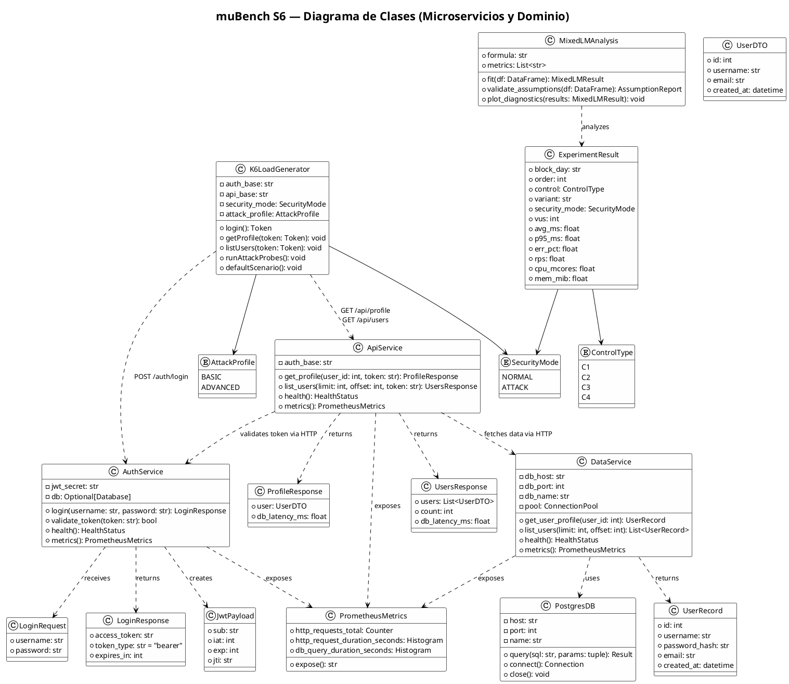
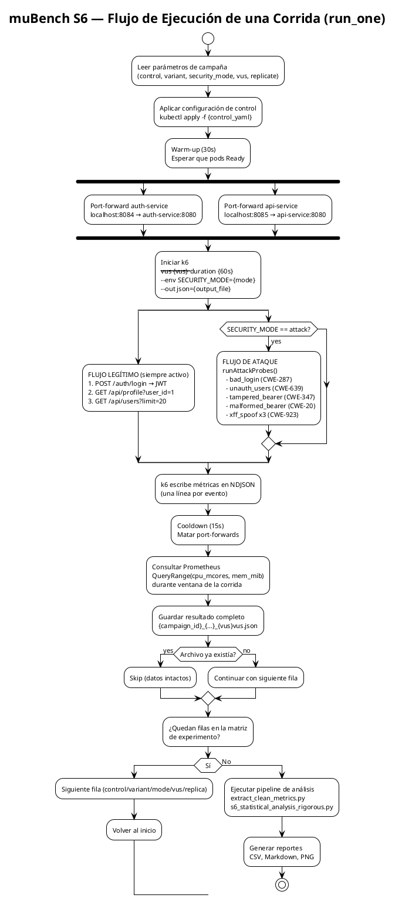

# Diagramas UML — muBench S6

> **Fecha:** 2026-05-14  
> Todos los diagramas están expresados en sintaxis **PlantUML**. Para renderizarlos: [https://plantuml.com](https://plantuml.com) o extensión PlantUML en VS Code.

---

## 1. Diagrama de Clases



---

## 2. Diagrama Relacional de Base de Datos

```plantuml
@startuml db_diagram
!theme plain
skinparam defaultFontSize 11

title "muBench S6 — Modelo Relacional (PostgreSQL 14)"

entity "users" as users {
  * id : SERIAL <<PK>>
  --
  * username : VARCHAR(64) <<UNIQUE, NOT NULL>>
  * password_hash : VARCHAR(255) <<NOT NULL>>
  * email : VARCHAR(128) <<UNIQUE>>
  * created_at : TIMESTAMP DEFAULT NOW()
  * is_active : BOOLEAN DEFAULT TRUE
}

entity "sessions" as sessions {
  * id : SERIAL <<PK>>
  --
  * user_id : INTEGER <<FK → users.id>>
  * jti : VARCHAR(64) <<UNIQUE, NOT NULL>>
  * issued_at : TIMESTAMP NOT NULL
  * expires_at : TIMESTAMP NOT NULL
  * revoked : BOOLEAN DEFAULT FALSE
}

entity "request_log" as reqlog {
  * id : BIGSERIAL <<PK>>
  --
  * service : VARCHAR(32) NOT NULL
  * method : VARCHAR(8) NOT NULL
  * path : VARCHAR(256) NOT NULL
  * status_code : INTEGER NOT NULL
  * duration_ms : FLOAT NOT NULL
  * timestamp : TIMESTAMP DEFAULT NOW()
  * user_id : INTEGER <<FK → users.id, nullable>>
}

entity "experiment_results" as expres {
  * id : SERIAL <<PK>>
  --
  * campaign_id : VARCHAR(64) NOT NULL
  * block_day : VARCHAR(32) NOT NULL
  * run_order : INTEGER NOT NULL
  * control : VARCHAR(8) NOT NULL
  * variant : VARCHAR(32) NOT NULL
  * security_mode : VARCHAR(16) NOT NULL
  * vus : INTEGER NOT NULL
  * replica : INTEGER NOT NULL
  * avg_ms : FLOAT
  * p95_ms : FLOAT
  * err_pct : FLOAT
  * rps : FLOAT
  * cpu_mcores : FLOAT
  * mem_mib : FLOAT
  * start_iso : TIMESTAMP
  * end_iso : TIMESTAMP
  * ndjson_file : TEXT
}

note right of experiment_results
  Esta tabla es el destino final
  del CSV consolidado.
  En la implementación actual se
  gestiona como CSV plano (no hay
  tabla física en PostgreSQL de
  análisis), pero el esquema refleja
  la estructura de
  s6_integrated_clean_metrics.csv
end note

entity "attack_events" as attacks {
  * id : BIGSERIAL <<PK>>
  --
  * experiment_result_id : INTEGER <<FK → experiment_results.id>>
  * vector : VARCHAR(32) NOT NULL
  * attempts : INTEGER NOT NULL
  * blocked : INTEGER NOT NULL
  * blocked_pct : FLOAT NOT NULL
  * cwe_id : VARCHAR(16)
}

'=== RELACIONES ===
users ||--o{ sessions : "has"
users ||--o{ reqlog : "generates (nullable)"
experiment_results ||--o{ attack_events : "contains"

note bottom of users
  Datos de prueba:
  username='demo', password='demo123'
  (cargados por init script de PostgreSQL)
end note

@enduml
```

---

## 3. Diagrama de Flujo — Ciclo de Vida de una Corrida



---

## 4. Diagrama de Paquetes

```plantuml
@startuml package_diagram
!theme plain
skinparam defaultFontSize 11
skinparam packageBackgroundColor #FEFEFE

title "muBench S6 — Diagrama de Paquetes"

package "RealisticServices" {
  package "k6" {
    [realistic-flow.js]
  }
  package "k8s" {
    [00-namespace.yaml]
    [01/02-postgres.yaml]
    [02-services.yaml]
    [03-services-real.yaml]
    [04-servicemonitor.yaml]
    [05-prometheusrule.yaml]
    [07-c1-*.yaml]
    [08-c3-*.yaml]
    [09-access-nodeports.yaml]
  }
  package "microservices (src)" {
    package "auth-service" {
      [app.py\n(FastAPI / Flask)]
      [jwt_utils.py]
    }
    package "api-service" {
      [app.py]
      [auth_client.py]
    }
    package "data-service" {
      [app.py]
      [db.py\n(psycopg2 pool)]
    }
  }
}

package "scripts" {
  [s6-integrated-profile.env]
  [run-s6-integrated-repro.sh]
  [verify-s6-integrated-config.sh]
  [generate_s6_integrated_matrix.py]
  [install_k6.sh]
  [validate_environment.sh]
}

package "Testing" {
  [extract_clean_metrics.py]
  [s6_statistical_analysis_rigorous.py]
  [attack_model_professional.py]
  [analyze_k6_results.py]
  [generate_plots.py]
  package "results" {
    [s6_integrated_all_6_metrics.csv]
    [s6_integrated_clean_metrics.csv]
    package "s6_analysis_rigorous" {
      [S6_INTEGRATED_STATISTICAL_REPORT.md]
      [threat_model_matrix.csv]
      [diagnostic_plots_*.png]
    }
    package "anova" {
      [anova_matrix_s2_s4_semantic.csv]
      [anova_matrix_s1_s2_fullfactor.csv]
    }
    package "auto_runs/randomized_campaigns" {
      [*.json (385 NDJSON files)]
    }
  }
}

package "Monitoring" {
  [mubench-dashboard.json]
  [mubench-servicemonitor.yaml]
}

package "documentecionFinal" {
  [01_controles.md]
  [02_metricas.md]
  [03_configuracion_infra.md]
  [04_arquitectura.puml]
  [05_diagramas_uml.md]
  [06_cargas_experimento.md]
  [07_diseno_experimental_S2.md]
  [08_seguridad.md]
}

' Dependencias entre paquetes
[realistic-flow.js] --> [07-c1-*.yaml] : carga configurada\npor campaña
[run-s6-integrated-repro.sh] --> [realistic-flow.js] : invoca k6
[run-s6-integrated-repro.sh] --> [s6-integrated-profile.env] : lee
[run-s6-integrated-repro.sh] --> [*.json (385 NDJSON files)] : genera
[extract_clean_metrics.py] --> [*.json (385 NDJSON files)] : parsea
[extract_clean_metrics.py] --> [s6_integrated_clean_metrics.csv] : genera
[s6_statistical_analysis_rigorous.py] --> [s6_integrated_clean_metrics.csv] : analiza
[s6_statistical_analysis_rigorous.py] --> [S6_INTEGRATED_STATISTICAL_REPORT.md] : genera
[auth-service] --> [04-servicemonitor.yaml] : expone /metrics
[api-service] --> [04-servicemonitor.yaml] : expone /metrics
[data-service] --> [04-servicemonitor.yaml] : expone /metrics

@enduml
```



---

## Cómo Renderizar

### Opción 1 — VS Code
Instala la extensión `PlantUML` (jebbs.plantuml), abre cualquiera de los bloques de código anteriores en un archivo `.puml` y presiona `Alt+D`.

### Opción 2 — Online
1. Copia el contenido entre `@startuml` y `@enduml`
2. Pega en [https://plantuml.com/plantuml](https://www.plantuml.com/plantuml/uml/)
3. El diagrama se renderiza automáticamente

### Opción 3 — CLI
```bash
java -jar plantuml.jar documentecionFinal/04_arquitectura.puml
# Genera: documentecionFinal/04_arquitectura.png
```
