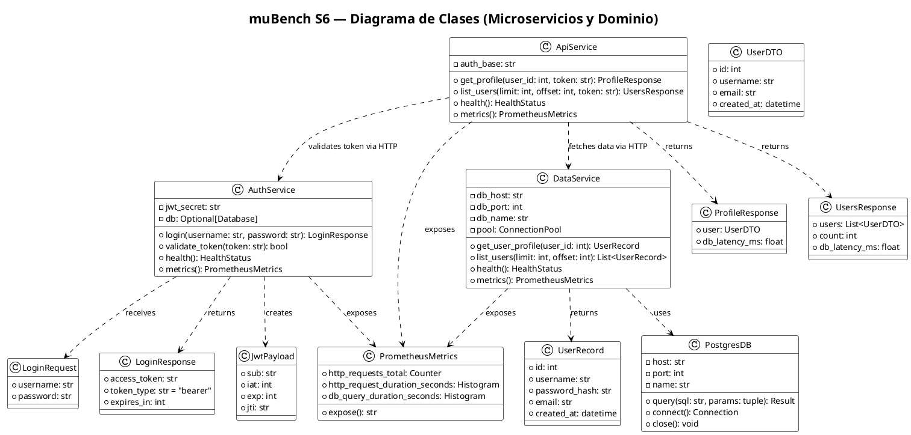
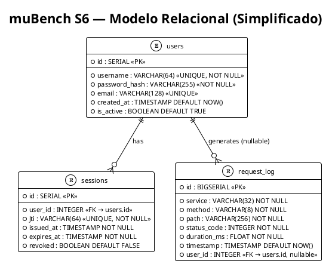
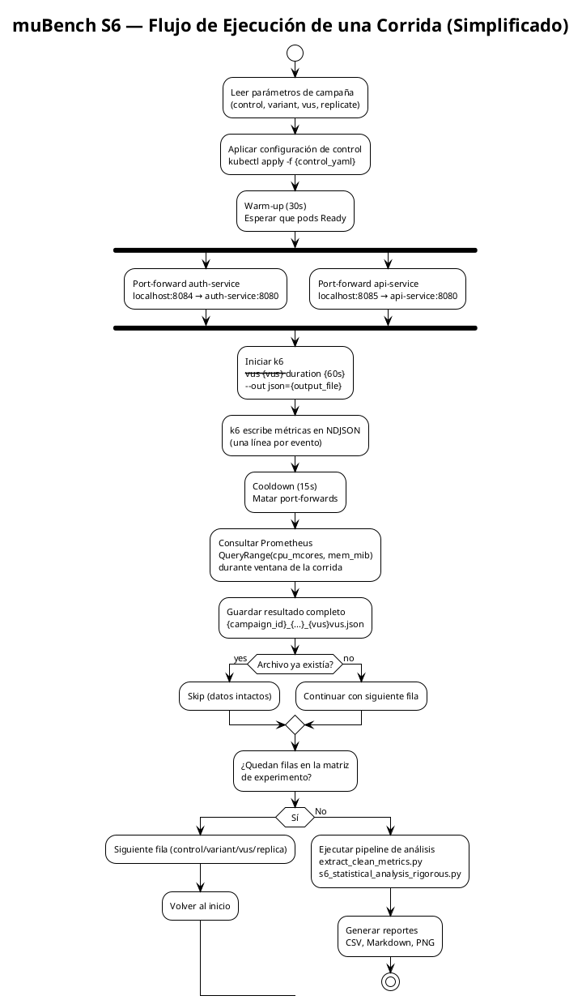

# Diagramas UML — muBench S6 (Simplificado)

> **Fecha:** 2026-05-14  
> Todos los diagramas están expresados en sintaxis **PlantUML**. Para renderizarlos: [https://plantuml.com](https://plantuml.com) o extensión PlantUML en VS Code.

---

## 1. Diagrama de Clases (Simplificado)



---

## 2. Diagrama Relacional de Base de Datos (Simplificado)



---

## 3. Diagrama de Flujo — Ciclo de Vida de una Corrida (Simplificado)



---

## Cómo Renderizar

### Opción 1 — VS Code
Instala la extensión `PlantUML` (jebbs.plantuml), abre cualquiera de los bloques de código anteriores en un archivo `.puml` y presiona `Alt+D`.

### Opción 2 — Online
1. Copia el contenido entre `@startuml` y `@enduml`
2. Pega en [https://plantuml.com/plantuml](https://www.plantuml.com/plantuml/uml/)
3. El diagrama se renderiza automáticamente

### Opción 3 — CLI
```bash
java -jar plantuml.jar documentecionFinal/05_diagramas_uml.md
# Genera: documentecionFinal/05_diagramas_uml.png
```
